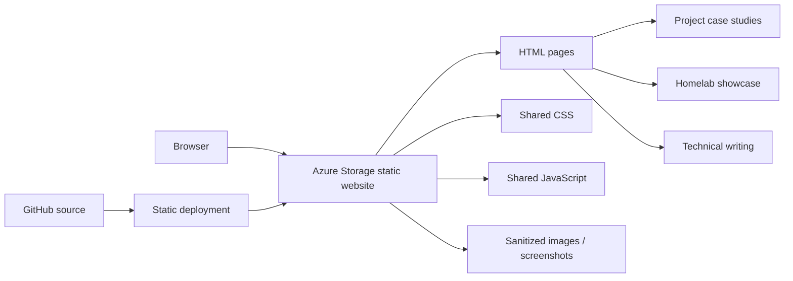
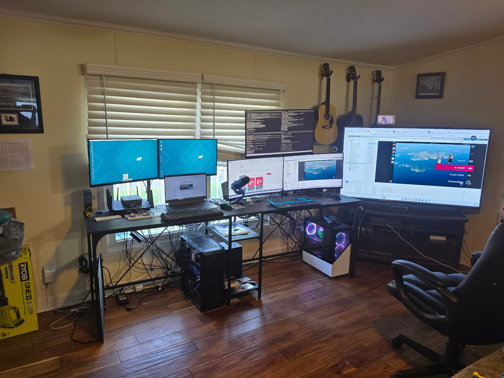

# Life in Your 50s

[](https://mystorageaccountusasa.z13.web.core.windows.net/)
[](https://azure.microsoft.com/)

A personal technical portfolio and homelab showcase built as a static website and hosted on Azure Storage. The site combines project case studies, infrastructure documentation, technical writing, career-transition context, and public-safe screenshots from a working homelab.

**Live site:** https://mystorageaccountusasa.z13.web.core.windows.net/  
**Projects:** https://mystorageaccountusasa.z13.web.core.windows.net/projects.html  
**Homelab:** https://mystorageaccountusasa.z13.web.core.windows.net/homelab.html

## 30-second overview

| | |
|---|---|
| **Purpose** | Technical portfolio, project evidence, homelab documentation, and writing |
| **Stack** | HTML, CSS, JavaScript |
| **Hosting** | Azure Storage static website |
| **Content** | Projects, case studies, homelab systems, technical writing, career journey |
| **Design goal** | Let a reviewer understand the work quickly, then choose how deep to go |
| **Security goal** | Show authentic technical evidence without publishing unnecessary private-network details |

## Site architecture



The site remains intentionally static: there is no database, server-side application, authentication layer, or API required for the public portfolio.

## What this demonstrates

- Building and maintaining a multi-page static website
- Organizing technical work for non-technical and technical reviewers
- Translating coursework and personal projects into concise portfolio case studies
- Presenting infrastructure evidence through sanitized screenshots and photographs
- Responsive HTML/CSS layout and reusable visual patterns
- Static-site deployment to Azure Storage
- Security-conscious decisions about what **not** to publish
- Cross-linking project repositories with deeper portfolio explanations

## Representative homelab evidence

The site uses real, public-safe images rather than generic stock artwork wherever practical.



Additional public-safe screenshots on the site include Proxmox, TrueNAS, Grafana, Pi-hole, CollectorVision, the digital-forensics lab, and the local LLM environment.

## Site sections

### Projects

The Projects page acts as a visual directory. Each entry gives enough context to understand what was built and links to a deeper case study, live project, or GitHub repository when one exists.

### Homelab

The Homelab page documents a working environment built around Proxmox virtualization, storage, monitoring, DNS filtering, local AI tooling, test systems, and supporting network infrastructure.

### Writing

The Writing section demonstrates technical communication, judgment, reflection, ethics, safety, systems thinking, and lessons drawn from coursework and prior industrial experience.

### My Journey

The Journey section explains the career transition behind the portfolio and connects earlier industrial/process-control experience with current cybersecurity and information-systems work.

## Design decisions and tradeoffs

### Static by design

The public portfolio does not need server-side execution. A static architecture keeps deployment simple, reduces attack surface, avoids unnecessary hosting complexity, and works well with Azure Storage.

### Evidence over decoration

Where screenshots or photos exist, the site favors genuine project and lab evidence. The goal is not to make every card visually identical; it is to make the work understandable and credible.

### Depth is optional

Directory pages stay relatively concise while stronger projects link to full case studies. A reviewer can scan quickly or continue into architecture, screenshots, troubleshooting decisions, and lessons learned.

### Public-safe documentation

Screenshots and descriptions are intentionally sanitized. The portfolio shows enough implementation detail to demonstrate the work without exposing unnecessary operational information.

## Public-safety decisions

The showcase intentionally avoids publishing:

- private/internal IP addresses
- SSH usernames and credentials
- MAC addresses
- VPN endpoints
- detailed reverse-proxy destinations
- screenshots that expose unnecessary private-network details
- unnecessary public detail about download/indexing infrastructure

Some screenshots are cropped or omitted specifically for this reason.

## Local preview

Double-click:

```text
PREVIEW-WEBSITE.bat
```

or run:

```powershell
python -m http.server 8000
```

Then open:

```text
http://localhost:8000/
```

## Azure Static Website deployment

The contents of the repository are deployed to the Azure Storage `$web` container.

Recommended static-website settings:

- Index document: `index.html`
- Error document: `404.html`

The repository itself remains the source-controlled copy; Azure Storage serves the deployed static files.

## Project structure

```text
articles/             Technical writing
projects/             Long-form project case studies
assets/css/           Shared styling
assets/js/            Shared browser behavior
assets/images/lab/    Public-safe homelab evidence
assets/images/projects/ Project screenshots and visuals
index.html            Home page
homelab.html          Homelab showcase
projects.html         Visual project directory
journey.html          Career-transition story
writing.html          Writing directory
privacy.html          Privacy information
404.html              Static error page
```

## Current direction

The site is intentionally kept simple and maintainable. Future improvements that could add value include a custom domain, sitemap, or a static-site generator such as Astro if reusable components and data-driven content eventually justify a build step.

The important constraint is unchanged: new technology should make the portfolio easier to maintain or understand, not add complexity merely for its own sake.
